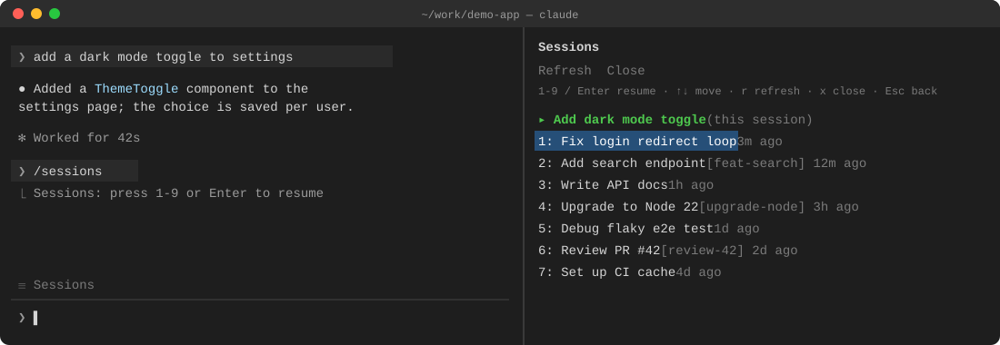

# cc-mods

Small Claude Code mods: function-hook plugins that add panes, bands and commands inside Claude Code.

## Mods

### session-switcher

A sidebar listing the current project's sessions. Pick one to resume it.



- `☰ Sessions` above the prompt, or `/sessions`, opens the pane with the keyboard on it
- `1`–`9` or `Enter` resumes a session, `r` refreshes, `x` closes, `Esc` goes back to the prompt
- `/sessions close` hides the pane from the prompt
- Sessions from the project's git worktrees are listed too, tagged with the worktree's name (`[feat-search] 12m ago`)
- A session is titled by its custom title, its AI title, or its first typed prompt; one with none of them is left out
- The open session is marked `▸ (this session)`

## Install

```
/plugin install session-switcher --marketplace ha-ptt0601/cc-mods
```

Answer `y` to add the marketplace, then pick the user scope.

## Develop

Run a mod straight from its folder, reloading on save:

```
claude --plugin-dir ./session-switcher
```

Check it:

```
claude plugin validate ./session-switcher
claude plugin test ./session-switcher
```
